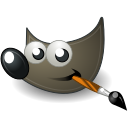
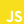

<!-- ### Hi there 👋 -->

<!--
**GersonRS/GersonRS** is a ✨ _special_ ✨ repository because its `README.md` (this file) appears on your GitHub profile.

Here are some ideas to get you started:

- 🔭 I’m currently working on ...
- 🌱 I’m currently learning ...
- 👯 I’m looking to collaborate on ...
- 🤔 I’m looking for help with ...
- 💬 Ask me about ...
- 📫 How to reach me: ...
- 😄 Pronouns: ...
- ⚡ Fun fact: ...
-->
<p align="center">
  
  <h3 align="center">gersonrsantos</h3>
  
  
  
</p>

<br>
### 🤙🏾 E aí, beleza? Eu sou Gerson 👋

<samp>
  </br>
  <p align="center">
    <a href="https://twitter.com/gersonrs3" target="_blank" >
      
    </a>
    <a href="https://instagram.com/gersonrsantos" target="_blank" >
      
    </a>
    <a href="https://www.linkedin.com/in/gerson-santos-a1442a90/" target="_blank" >
      
    </a>
    <a href="https://t.me/gersonrsantos" target="_blank" >
      
    </a>
    <a href="mailto:gersonrodriguessantos8@gmail.com" target="_blank" >
      
    </a>
  </p>
</samp>

Sou formado em Sistemas de Informação pela Universidade Federal Rural de Pernambuco(UFRPE) e mestre em Ciencia da Computação através do programa de Pós-graduação em Informatica Aplicada também da UFRPE, apaixonado por tecnologia e games.
<br/>
Horas vagas gosto de jogar **Dota 2** e outros jogos mobas e FPS, atualmente estou focando meus estudos na área de Machine Learning com **Python** e **Matlab**. Também curto mexer com prototipagens de tela com **Figma** e edições de imagem com **Gimp 2**.

```js
  const importantLinks = {
    📒 Linkedin: 'https://www.linkedin.com/in/gerson-santos-a1442a90/',
    👨🏾‍💻 Site: 'https://gersonrs.github.io/',
    👋 Email: 'gersonrodriguessantos8@gmail.com',
  }
```

### 💻 Skills

#### 🎨 Design: <br/>

<samp>
  <p align="left">
    
    
  </p>
</samp>

#### 💬 Linguagens: <br/>

<samp>
  <p align="left">
    
    
    
    
    
    
    
  </p>
</samp>

#### 🔨 Framework: <br/>

<samp>
  <p align="left">
    
    
    
    
    
  </p>
</samp>
  
#### 📦 Banco de Dados: <br/>
<samp>
    <p align="left">
      
      
    </p>
  </samp>
  
#### 🔧 Ferramentas & ambientes: <br/>
   <samp>
    <p align="left">
      
      
      
      
      
      
      
      
      
      
      
      
    </p>
  </samp>

<p align="center">
    
  
</p>
